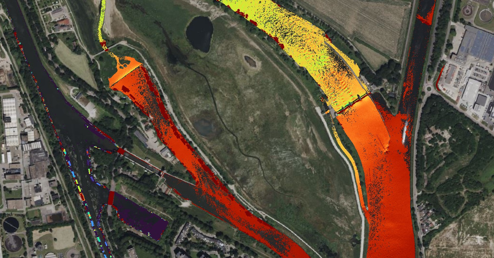

# Heron



This project, funded by Digishape Seed Money, focuses on the inspection of water levels using LiDAR images from drones. It includes scripts that process .las/.laz files. You can apply several filtering functions to the .las/.laz files to get the desired output. Each function used adds an abbreviation that describes the function's actions. More information about the project can be read on https://www.digishape.nl/projecten/algoritmische-bepaling-van-waterstanden-met-remote-sensing and a report of the project (in Dutch) can be found in the 'docs' folder.

## How to Use

### Step 1: Load .las/.laz file and geometries
- Move your .las/.laz file to the `data/raw` directory.
- Specify the name of the .las file.
- Specify the file extension (.las/.laz).
- Define the coordinate reference system.
- Define geometries in the `data/external` directory.

### Step 2: Choose filter options
Select the filter functions that you want to apply to the point cloud.

### Step 3: Execute functions
Run the defined functions.

### Step 4: Write output to file(s)
Figures and maps will be written to the directory `data/output`. If `create_tif` is set to `True`, a .tif file is created and stored in the same directory.

## Installation

Before you start using this project, you need to ensure that you have the necessary software installed and the project set up on your local machine. Follow the steps below:

### Prerequisites

- Python 3.10 or later
- pip (Python package installer)

### Steps

1. Clone the repository to your local machine:

```bash
git clone https://github.com/tberends/heron.git
```
2. Navigate to the project directory:

```bash
cd heron
```
3. Install the required Python packages:

```bash
pip install -r requirements.txt
```
Now, you're ready to use the project. Refer to the "How to Use" section for further instructions.
