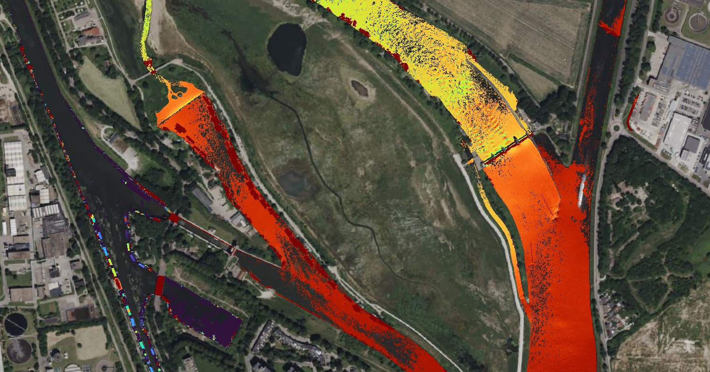

[](https://www.python.org/)
[](https://opensource.org/licenses/MIT)
[](https://github.com/tberends/heron/commits/master)
[](https://github.com/tberends/heron/issues)
[](https://github.com/tberends/heron)

# Heron

Dit project, gefinancierd door Digishape Seed Money, richt zich op het inspecteren van waterpeilen met behulp van LiDAR-beelden van drones. Het bevat scripts die .las/.laz bestanden verwerken. Je kunt verschillende filterfuncties toepassen op de .las/.laz bestanden om de gewenste output te verkrijgen. Elke gebruikte functie voegt een afkorting toe die de acties van de functie beschrijft. Meer informatie over het project is te vinden op https://www.digishape.nl/projecten/algoritmische-bepaling-van-waterstanden-met-remote-sensing en een rapport van het project (in het Nederlands) is te vinden in de 'docs' map.

## Functionaliteit

Het script biedt de volgende functionaliteit:

1. **Automatische bestandsverwerking**
   - Verwerkt automatisch alle .las/.laz bestanden in de `data/raw/` directory
   - Ondersteunt zowel .las als .laz formaten
   - Voorkomt dubbele verwerking van bestanden
   - Logt alle verwerkingsstappen met timestamp
   - Kan grote bestanden opsplitsen in kleinere delen voor efficiëntere verwerking

2. **Filtering opties**
   - **Spatiale filtering**: Filtert punten binnen waterlichamen
   - **Hoogte filtering**: Filtert punten op basis van minimum en maximum waterpeil
   - **Centerline filtering**: Filtert punten rondom een berekende centerline van waterlichamen met instelbare bufferafstand
   - **Datumfiltering voor waterlichamen**: Filtert waterlichamen op basis van een referentiedatum

3. **Output generatie**
   - Genereert rasterbestanden (.tif) met 1x1m celgrootte
   - Berekent Z-waarden op basis van gemiddelde, mediaan of modus
   - Maakt visualisaties (.png) met waterlichamen en rasterdata
   - Genereert frequentiediagrammen voor specifieke RD-coördinaten
   - Berekent statistieken (gemiddelde of mediaan) per polygoon uit een GDB- of GPKG-bestand

4. **Logging**
   - Uitgebreide logging van alle verwerkingsstappen
   - Logs worden opgeslagen in de `logs/` directory met timestamp
   - Bevat informatie over verwerking, fouten en resultaten
   - Logging naar zowel bestand als console

## Installatie

1. Clone de repository
2. Zorg voor **Python 3.10 of nieuwer** (vereist door o.a. GeoPandas 1.1.x).
3. Installeer de vereiste packages:
```bash
pip install -r requirements.txt
```

## Tests

Na `pip install -r requirements.txt` (bevat pytest): vanaf de reporoot `pytest tests/ -v`. Tests die `data/raw/X126000Y500000.laz` (of reporoot) nodig hebben, worden overgeslagen als dat bestand ontbreekt; overige tests gebruiken mocks of synthetische data.

## Gebruik

Het script kan worden uitgevoerd met verschillende opties:

```python
main(
    filter_geometries=False,           # Filter op waterlichamen
    filter_minmax=False,               # Filter op hoogte
    min_peil=-1,                       # Minimum waterpeil
    max_peil=1,                        # Maximum waterpeil
    waterdelen_reference_date=None,    # Referentiedatum voor waterlichamen
    filter_centerline=False,           # Filter op centerline
    buffer_distance=1.0,               # Bufferafstand tot centerline in meters
    raster_averaging_mode="mode",      # Berekening raster (mode/mean/median)
    create_tif=True,                   # Genereer TIF bestanden
    output_file_name=[],               # Lijst met afkortingen voor output bestandsnaam
    frequencydiagram=False,            # Genereer frequentiediagram
    coordinates=(126012.5, 500481),    # RD-coördinaten voor frequentiediagram
    polygon_file=None,                 # Pad naar .gdb of .gpkg bestand met polygonen
    polygon_statistic="mean"           # Type statistiek voor polygonen (mean/median)
)
```

### Bestanden opsplitsen

Grote LAS/LAZ bestanden kunnen worden opgesplitst in kleinere delen voor efficiëntere verwerking:

```bash
python -m src.chunk_files input.las output_directory 50x65.14
```

Parameters:
- `input.las`: Het te splitsen LAS/LAZ bestand
- `output_directory`: Directory waar de gesplitste bestanden worden opgeslagen
- `50x65.14`: Maximale grootte van elk deel in meters (breedte x hoogte)
- `--points-per-iter`: Optioneel, aantal punten per iteratie (standaard: 1 miljoen)

De bestanden worden opgesplitst op basis van ruimtelijke grenzen en krijgen een naam in het formaat: `originele_naam_x_min_y_max.las`

## Directory structuur

```
heron/
├── docs/              # o.a. projectrapport en README-afbeeldingen
├── data/
│   ├── raw/           # Input .las/.laz bestanden
│   ├── processed/     # Verwerkte bestanden
│   └── output/        # Output bestanden (.tif, .png, .gpkg)
├── logs/              # Log bestanden
├── tests/             # Pytest-tests (o.a. LAZ-fixture, src-modules)
├── src/               # Broncode
│   ├── chunk_files.py
│   ├── create_plots.py
│   ├── filter_functions.py
│   ├── filter_spatial.py
│   ├── generate_raster.py
│   ├── get_waterdelen.py
│   └── import_data.py
├── pytest.ini
├── requirements.txt
└── main.py           # Hoofdscript
```

## Module beschrijvingen

### src/import_data.py
- `load_data(lasfile, data_dir)`: Laadt en verwerkt .las/.laz bestanden

### src/filter_spatial.py
- `filter_spatial(points, waterdelen)`: Filtert punten binnen waterlichamen
- `calculate_centerline(waterdelen, buffer_distance)`: Berekent centerline van waterlichamen
- `calculate_polygon_statistics(raster_points, polygon_file, statistic)`: Berekent statistieken per polygoon

### src/filter_functions.py
- `filter_by_z_value(points, min_peil, max_peil)`: Filtert punten op basis van hoogte
- `filter_by_proximity_to_centerline(points, centerline, distance)`: Filtert punten rondom centerline

### src/generate_raster.py
- `generate_raster(points, mode)`: Genereert raster van punten met verschillende berekeningsmethoden

### src/get_waterdelen.py
- `get_waterdelen(bbox, reference_date)`: Haalt waterlichamen op via PDOK API, met optionele filterdatum

### src/create_plots.py
- `plot_frequency(points, coordinates, filename)`: Genereert frequentiediagram voor specifieke locatie
- `plot_map(raster_points, points, waterdelen, filename, out_name)`: Maakt visualisatie van resultaten

### src/chunk_files.py
- `split_las_file(input_file, output_dir, size, points_per_iter)`: Splitst LAS/LAZ bestanden in kleinere delen
- `recursive_split(x_min, y_min, x_max, y_max, max_x_size, max_y_size)`: Berekent de grenzen voor de splitsing
- `tuple_size(string)`: Converteert een string in het formaat 'breedte x hoogte' naar een tuple

## Output bestanden

Het script genereert de volgende output bestanden:
- `*.tif`: Rasterbestanden met gefilterde punten
- `*.png`: Visualisaties van de resultaten
- `*.gpkg`: GeoPackage bestanden met berekende polygoonstatistieken
- `*.log`: Log bestanden met verwerkingsinformatie
- `*_x_min_y_max.las`: Gesplitste LAS/LAZ bestanden

## Logging

Alle verwerkingsstappen worden gelogd met:
- Timestamp
- Log level (INFO/WARNING/ERROR)
- Gedetailleerde berichten
- Bestandsnamen en verwerkingsresultaten
- Logging naar zowel bestand als console

## Afhankelijkheden

Zie `requirements.txt` voor vaste versies. Kernpakketten:

- numpy
- pandas
- shapely
- pyogrio (vector-I/O voor GeoPandas)
- fiona
- geopandas
- laspy
- lazrs
- xarray
- rioxarray
- contextily
- matplotlib
- pytest (tests draaien)

## Bijdragen

Bijdragen zijn welkom. Kort overzicht:

1. **Issues** — Voor bugs, wensen of vragen kun je een [GitHub-issue](https://github.com/tberends/heron/issues) openen.
2. **Pull requests** — Fork de repository, maak een branch vanaf `master`, implementeer je wijziging en open een PR met een duidelijke beschrijving (wat en waarom).
3. **Tests** — Voer `pytest tests/ -v` uit voordat je een PR indient; voeg waar passend tests toe voor nieuwe of gewijzigde logica in `src/` of `main.py`.
4. **Stijl** — Sluit aan bij de bestaande code (imports, logging, type hints waar al gangbaar). Houd wijzigingen zo klein mogelijk en gericht op één onderwerp per PR.
5. **Data en geheimen** — Commit geen grote LiDAR-bestanden, persoonsgegevens of API-sleutels; gebruik `.env` of lokale data buiten git zoals nu in `.gitignore` bedoeld.

Voor inhoudelijke vragen over het Digishape-project, zie de link naar het project in de introductie hierboven.
